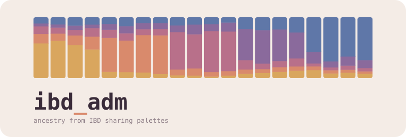

<h1>
  
</h1>

`ibd_adm` is a collection of tools for genetic clustering and supervised ancestry estimation using IBD-sharing profiles. Starting from precomputed pairwise IBD segments (one file per chromosome, for example from IBDseq), the workflow implements:

- preprocessing of pairwise IBD sharing data, including masking of excess IBD coverage region and total IBD per pair of individuals;
- genetic clustering of individuals into populations based on total IBD sharing profiles;
- aggregation of pairwise total IBD sharing into IBD sharing palettes between individuals and populations;
- between-population TVD (total variation distance) matrix estimation and visualization;
- supervised ancestry proportion estimation of target individuals from source populations (NNLS and Bayesian), with residual diagnostics;
- PCA on the IBD sharing palettes; and
- optionally population-specific IBD peak scanning.

**Key terms**

- **Palette**: IBD sharing profiles of individuals, i.e. the total IBD (cM) an individual shares with each donor population. Population palettes are the
  IBD-sharing profiles between populations (and the TVD matrix is the distance between them).
- **Population / cluster**: a group of individuals, either a cluster from the built-in clustering or a population
  defined in a custom panel.
- **Panel**: one set of population definitions (the *default* panel from the clustering, or a *custom* panel) on which
  the stages from aggregation onwards run (see [Pipeline overview](#pipeline-overview)).
- **Source and target**: a target individual's palette is modelled as a mixture of the palettes of the source
  populations. A *mixture set* (`mixture_<set>.tsv`) lists which individuals are sources and which are targets.

---

## Pipeline overview

[`workflow/Snakefile`](workflow/Snakefile) combines seven rule modules from
[`workflow/rules/`](workflow/rules), each with dedicated sections in the configuration file `config.yml`. Some stages such as clustering, mixture modelling and window peaks are optional and can be switched off.

```
Precomputed IBD segments ({chrom}...ibd.gz)  +  config/individuals.tsv
      │
 1. ibd_mask        get_genomecov → mask_ibd
      │             per-base IBD coverage → excess-coverage mask BED (+ QC PDF)
      │
 2. ibd_tot         get_excl_mask → get_ibd
      │             length/LOD filter, subtract mask, sum total IBD per pair
      │
 3. cluster_ibd     build_feature_matrix → distance_matrix → hclust
      │                 → cut_tree → plot_clusters
      │             sample×sample IBD matrix → distance → hierarchical clustering
      │             → adaptive tree cut (one default panel) → cluster labels
      │
 4. aggregate_ibd   make_default_agg_panel → aggregate_ibd → tvd
      │                 → default_color_map → tvd_plot
      │             per-population IBD sharing, TVD matrix, colour/shape map
      │
      ├─ 5. mixmodel_ibd   make_mix_sample_map → make_default_mixture_auto
      │                        → run_models (nnls + bayesian)
      │                        → plot_mixmodel / grid / source_legend
      │                        → residual_profiles → residual_diagnostic
      │                    per-target ancestry proportions + SE/ESS/Rhat, barplots
      │
      ├─ 6. pca_ibd        pca (+ pca projected onto source populations)
      │
      └─ 7. ibd_window_peaks  coverage_by_pop → window_average → outliers → plots
                           (disabled by default)
```

From stage 4 / aggregation of IBD onwards, the workflow can run on two types of panels:

- **default**: If genetic clustering was enabled, a single panel corresponding to the specified configuration
- **custom**: any number of custom panels listed under `aggregation.panels`, each with their own sample-to-population mapping and colour scheme (see [Custom-panel files](#custom-panel-files-configpanelspanel)).

---

## Ancestry estimation in brief

For each **target** sample, the IBD-sharing palette is modelled as a non-negative
mixture of **source**-population profiles. Two estimators are available
(`mixture.method`):

- **`nnls`**: non-negative least squares (`lsei::pnnls`) with per-chromosome
  block-jackknife standard errors.
- **`bayesian`**: a SOURCEFIND-style MCMC with a Dirichlet proposal, adaptive
  proposal scaling and an active-source search (spike-and-slab over the source
  palette). It reports acceptance rate, ESS and R-hat.

`mixture.palette_scale` sets how palettes are scaled before fitting. With `normalized` (default), each palette is divided by its total, so it holds the proportion of an individual's IBD shared with each donor population; a source that carries more total IBD per individual is then slightly over-credited, which can bias the estimates. With `raw`, the sources are mean per-individual palettes in cM, the target is fitted up to a free scale, and the weights are normalized afterwards. `raw` can re-estimate proportions when the sources differ strongly in total IBD, but only for sources of comparable total sharing: a single low-sharing source can take any weight (see [docs/DIAGNOSTICS.md](docs/DIAGNOSTICS.md#palette-scale)).

Custom mixture model sets are defined using a `mixture_<set>.tsv` file assigning individuals as sources (`group == source`) or targets (`group == target`). Alternatively, the workflow also implements automatically created sets for the clustering panels (not custom panels), using the TVD / neighbour-joining tree (`mixture_auto`, controlled by
the `mixture.auto_source_*` knobs).

Diagnostics:

- A residual diagnostic flags source populations that act as poor proxies and names
  the unused population they stand in for. It runs whenever `bayesian` is enabled;
  `source_flags.tsv` also needs `nnls`, as it reports the disagreement between the
  two estimators.
- `res_norm_ex_self` is the residual excluding the target's own cluster, the
  statistic to compare across targets.
- Sources are screened for an R scale offset (`source_R_flags.tsv`): R is the mean total IBD per individual that a source emits into the donor panel, and sources whose R is far from the panel median can show deflated (low R) or inflated (high R) weights. A per-target risk tier (`target_R_flags.tsv`) shows how much each estimate rests on such sources.
- NNLS fits can be evaluated by chromosome hold-out CV (`mixture.cv`, only with
  `palette_scale: normalized`).

More detailed descriptions of configuration and output columns can be found in
[`docs/CONFIGURATION.md`](docs/CONFIGURATION.md#mixture-output-tables) and the
interpretation of each diagnostic in [`docs/DIAGNOSTICS.md`](docs/DIAGNOSTICS.md).

---

## Requirements

- **Snakemake** (workflow engine).
- **Command-line tools** on `PATH`: `bedtools`, GNU `datamash`, `gawk`, `gzip`,
  `sort`.
- **Python 3** with `pandas` and `numpy`.
- **R** with:
  `argparse`, `readr`, `dplyr`, `tidyr`, `purrr`, `tibble`, `stringr`, `rlang`,
  `data.table`, `ggplot2`, `scales`, `scico`, `grid`, `grDevices`,
  `future`, `furrr`, `parallelDist`, `fastcluster`, `dynamicTreeCut`,
  `lsei`, `Rtsne`, `ape`, `phytools`, `data.tree`, `igraph`, `tidygraph`,
  `ggraph`, `ggtree`, `heatmap3`.

No environment file is provided; install the packages with conda, `renv` or system packages.

---

## Inputs

### IBD segments (`input_data.ibd`)

One file per chromosome; the `{chrom}` wildcard is filled from
`config/chromosomes.txt`. Files are gzip-compressed, whitespace/TSV delimited,
with a one-line header (skipped). The workflow reads these columns:

| column | meaning                    |
|-------:|----------------------------|
| 1      | sample id 1                |
| 2      | sample id 2                |
| 3      | chromosome                 |
| 4      | segment start (bp)         |
| 5      | segment end (bp)           |
| 6      | LOD / score                |
| 9      | segment length (cM)        |

These columns are required, at exactly these positions; all other columns are ignored. Both sample ids must appear in `individuals.tsv`. The input file can come from any IBD estimation method. A fast reimplementation of IBDseq generating already properly formatted input files is available at https://github.com/martinsikora/ibdseq_rs

### Sample sheet (`input_data.individuals` → `config/individuals.tsv`)

| column      | meaning |
|-------------|---------|
| `sample_id` | must match the ids in the IBD segment files |
| `label`     | free-text population label, used for plotting |
| `group`     | `cluster_full` (used to build the clustering tree, typically high quality, non-related individuals), `cluster_min_dist` (assigned to a cluster afterwards by k-NN, can include close relatives or poorer quality individuals), or `exclude` |

### Reference (`ref`)

- `genome`: chromosome-length file (`chrom  length`) used by `bedtools genomecov`.
- `chromosomes`: the chromosome list (`config/chromosomes.txt`).
- `marker_file`: per-chromosome marker counts (`config/n_markers.tsv`), used by
  the mixture model as chromosome block sizes for the weighted jackknife standard errors (and to balance the folds of
  `mixture.cv: k<K>`). If IBDseq is used, typically the number of markers after LD pruning.

### Custom-panel files (`config/panels/<panel>/`)

A custom panel is defined by setting up a folder `config/panels/<panel>/` listed in `aggregation.panels`, containing the following set of configuration files:

| file                 | columns                          | purpose |
|----------------------|----------------------------------|---------|
| `aggregate.tsv`      | `sample_id, pop_id, group`       | maps samples to populations. `pop_id` is the chosen label, one per population or cluster; set it to `exclude` to drop a sample. `group == donor_recipient` marks the individuals that define the populations (typically the well-clustered, unrelated core) and are included in the palette of their `pop_id`. `group == recipient` individuals (relatives, lower-quality samples, anything assigned to a cluster afterwards) do not contribute to the palettes, but still receive one against the populations of all `donor_recipient` individuals. |
| `color_map.tsv`      | `pop_id, color, fill, shape`     | plotting colours/shapes; its `pop_id` set should match `aggregate.tsv`. Optional; without it the panel gets mixture tables only (no TVD matrix or plots, PCA or mixture plots). |
| `mixture_<set>.tsv`  | `sample_id, group`               | defines one mixture model set named `<set>`; `group` ∈ `{target, source}`. Multiple set files can be defined per panel. |
| `panel.yml`          | `include_recipient_only_pops`, `include_pops`, `exclude_pops`, `mixture:` | optional per-panel settings. The three pop options treat recipient-only populations (for example single-individual clusters, recipient-only by design as they can't provide within-cluster sharing) as full clusters in the TVD tree and plots and drop catch-all bins such as `unassigned`; they replace the panel's entry in `aggregation.full_cluster_pop_overrides`. The `mixture:` block overrides how models are fitted for this panel (for example `palette_scale`, `mean_active_sources`, `seed`), merged over the global `mixture.*` values. See [docs/CONFIGURATION.md](docs/CONFIGURATION.md). |

When genetic clustering is enabled, a panel based on the clustering results is automatically created with name based on clustering setting configuration. In this scenario, automatically generated `aggregate.tsv` / `color_map.tsv` files with the clustering results as populations will be created, using `cluster_full` individuals as `donor_recipient` and `cluster_min_dist` as `recipient`. Additionally, an automatic mixture set named `auto` is also generated (sources auto-selected from the TVD tree) and run when `mixture.enabled` is true; add
`config/panels/default/mixture_<set>.tsv` to additionally define named sets by hand (`default` is the folder for hand-defined sets for the auto-generated clustering panels).

---

## Outputs

All outputs are written under `results/`:

```
results/
  masking/{tables,plots}/            # coverage tables, mask BEDs, QC PDFs
  ibd_tot/tables/                    # masked per-pair total IBD
  cluster_cache/<tag>/               # shared clustering intermediates (.rds)
  panels/<panel>/
    clustering/                      # cluster assignments + dendrogram/heatmap
    aggregation/{tables,plots,panels}/   # ibd_pop.tsv.gz, TVD matrix, colour map
    mixmodel/<set>/{tables,plots,diagnostics}/   # model estimates, barplots, flags
    pca/<set>/{tables,plots}/        # PCA tables + plots
    ibd_window_peaks/{tables,plots}/ # (when enabled)
```

`<panel>` is a generated clustering panel (`cluster_h<height>_<tag>`) or a custom
panel name. `<tag>` encodes the distance, transform and agglomeration settings
(`d<dist>_n<transform>_m<clust>`), so changing them writes to a new directory.

---

## Example dataset

[`example/`](example) holds a small simulated dataset: 48 individuals on 22 human-sized chromosomes, made of an outgroup `O`, two sources `S1` and `S2`, and an admixed population `X` formed 12 generations ago
from 60% `S1` and 40% `S2`. To run it through the workflow, use

```bash
snakemake --cores 8        # a few minutes; seeds are fixed in config/config.yml
```

This will carry out genetic clustering, and fitting the sources and targets specified in
`config/panels/default/mixture_four_pop.tsv`, as well as the automatic source selection. The data and the expected output are described in [`example/README.md`](example/README.md). A stage-by-stage
[walkthrough](docs/walkthrough/README.md) shows the real outputs of this example (clustering, palettes, mixture fits, diagnostics,
variants to try).

---

## Running

From the repository root (where `config/` lives):

```bash
# 1. Dry run: build the DAG and validate config without executing anything
snakemake -n

# 2. Run locally with N cores
snakemake --cores 16

# 3. Build a specific target
snakemake --cores 8 results/ibd_tot/tables/1.example_dataset.ibd_tot.tsv.gz
```

Larger datasets may need more memory and CPU, and a cluster executor may then be
needed. The rules declare `mem_mb` and `runtime` resources. Pass a Snakemake
profile or executor (for example `--workflow-profile <profile>` or
`--executor slurm`); no profile is included.

`aggregation.max_concurrent_ibd_jobs` and
`ibd_window_peaks.max_concurrent_coverage_jobs` limit how many aggregation and
coverage jobs run at the same time.

---

## Repository layout

```
config/
  config.yml                     # all workflow parameters (see docs/CONFIGURATION.md)
  chromosomes.txt                # chromosomes to process, one per line
  n_markers.tsv                  # per-chromosome marker counts (chrom, n)
  genome.txt                     # chromosome lengths (chrom, bp)
  individuals.tsv                # sample sheet (sample_id, label, group)   [EXAMPLE]
  panels/
    default/
      mixture_four_pop.tsv       # sources and targets for the default clustering panel   [EXAMPLE]
example/                         # the example dataset (see above)         [EXAMPLE]
  ibd_segments/                  #   one IBD segment file per chromosome
  simulation/scenario.yaml       #   how it was simulated
  expected/                      #   clusters, realized ancestry, expected results
  results/                       #   curated outputs of one run, shown in the walkthrough
  variants/                      #   configs for the walkthrough's "try this" runs
  make_walkthrough.py            #   curates results/ from a run and writes docs/walkthrough/
  README.md
workflow/
  Snakefile
  rules/*.smk                    # the 7 pipeline stages
  scripts/{python,r,awk}/        # step implementations
docs/
  CONFIGURATION.md               # full per-knob reference
  DIAGNOSTICS.md                 # how to read the estimates and diagnostics
  walkthrough/                   # the example, stage by stage, with its real outputs
results/                         # all outputs generated
```

Files marked **[EXAMPLE]** belong to the example dataset or show the required format.
Replace them with your data (see [Supplying real data](#supplying-real-data)).

---

## Supplying real data

1. Point `input_data.ibd` at your per-chromosome IBD segment files (keep the
   `{chrom}` wildcard) and `input_data.individuals` at your sample sheet.
2. Set `ref.genome` (and `ref.chromosomes` / `ref.marker_file`) to your reference.
3. Set `prefix` to your dataset name (it appears in every output filename).
4. Optionally set `tmpdir` to a scratch location for temporary files.
5. Delete `config/panels/default/mixture_four_pop.tsv` (it names the example's
   individuals) and write your own `mixture_<set>.tsv` there, or rely on the
   automatic source selection. List any custom panels under `aggregation.panels`
   (empty in the example) and provide the corresponding `config/panels/<name>/` files.
6. Set the clustering cut (`clustering.base_height`, `gate_height` and `deep_split`; the example uses a plain cut at
   1.0 with `deep_split` 1, see [`example/README.md`](example/README.md#what-the-clustering-settings-do)) and the masking length cutoff (`masking.ibd_params.min_l_cm`) for
   your data.

---

## References

The methods implemented here have been first introduced in Allentoft, Sikora et al. 2024, with further refinements and testing in McColl et al. 2025a, b.
A manuscript describing the full suite is in preparation; until then, please refer to these studies when citing the
methods.

- Allentoft ME, Sikora M, Refoyo-Martínez A, et al. Population genomics of post-glacial western Eurasia. *Nature* 625,
  301-311 (2024).
- McColl H, Kroonen G, Moreno-Mayar JV, et al. Steppe ancestry in western Eurasia and the spread of the Germanic languages.
  *bioRxiv* (2025a). doi:10.1101/2024.03.13.584607
- McColl H, Kroonen G, Pinotti T, Barrie W, Koch J, Ling J, Demoule J-P, Kristiansen K, Sikora M, Willerslev E. Tracing the
  spread of Celtic languages using ancient genomics. *bioRxiv* (2025b). doi:10.1101/2025.02.28.640770


**Methods and ideas this workflow was built on**

- Lawson DJ, Hellenthal G, Myers S, Falush D. Inference of population structure using dense haplotype data. *PLoS Genetics* 8,
  e1002453 (2012). (ChromoPainter)
- Chacón-Duque J-C, Adhikari K, Fuentes-Guajardo M, et al. Latin Americans show wide-spread Converso ancestry and imprint of
  local Native ancestry on physical appearance. *Nature Communications* 9, 5388 (2018). (SOURCEFIND, on which the Bayesian
  estimator is modelled)
- Browning BL, Browning SR. Detecting identity by descent and estimating genotype error rates in sequence data. *American
  Journal of Human Genetics* 93, 840-851 (2013). (IBDseq)
- Langfelder P, Zhang B, Horvath S. Defining clusters from a hierarchical cluster tree: the Dynamic Tree Cut package for R.
  *Bioinformatics* 24, 719-720 (2008).


---

## License

GPL-2.0-or-later. See [`LICENSE`](LICENSE). Source files carry
`Copyright Martin Sikora <martin.sikora@sund.ku.dk>`.
