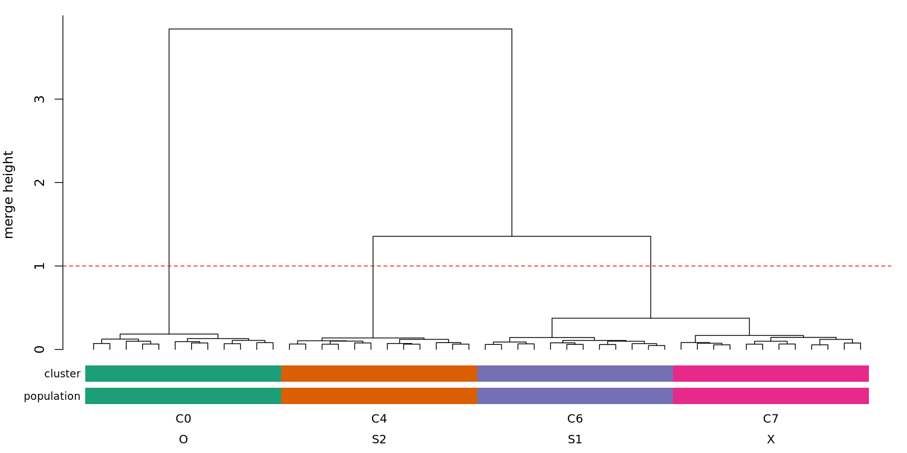
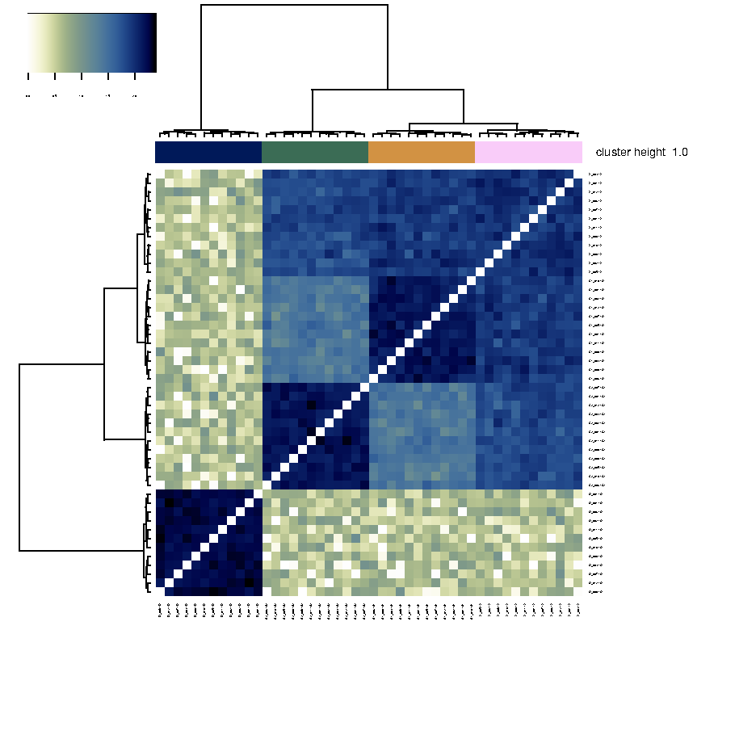

# 2. Clustering

**In:** the per-pair IBD totals (after masking regions of excess IBD coverage). **Out:** `clustering/default.example_dataset.clusters.tsv`
and two plots. The individuals are clustered hierarchically (Ward's method on a cosine distance of their IBD vectors) and the
tree is cut with `dynamicTreeCut` at a fixed height.

The tree has three large merges, at heights 3.84, 1.36, 0.38; everything else is below 0.19. The dashed line is the cut height
(`clustering.base_height` = `gate_height` = 1.0). The coloured strips under the leaves are the clusters the workflow
assigns and the true populations. A plain cut of the tree at 1.0 would give three clusters, because S1 and X join at 0.38.
The adaptive cut (`dynamicTreeCut`) works on the shape of the branches below the height and keeps those two cohesive groups
apart; how readily it splits is `deep_split`.

| merge rank | height |
|---|---|
| 1 | 3.841 |
| 2 | 1.356 |
| 3 | 0.375 |
| 4 | 0.185 |
| 5 | 0.168 |

Compared with the true populations (`example/results/clustering/clusters.tsv`), each cluster is exactly one population:

| cluster | O | S1 | S2 | X |
|---|---|---|---|---|
| C0 | 12 | 0 | 0 | 0 |
| C4 | 0 | 0 | 12 | 0 |
| C6 | 0 | 12 | 0 | 0 |
| C7 | 0 | 0 | 0 | 12 |

## Knobs

| key | here | effect |
|---|---|---|
| `clustering.base_height`, `gate_height` | 1.0, 1.0 | cut height; equal = plain cut, lower `gate_height` = sharing-gated finer cut |
| `clustering.deep_split` | 1 | how readily a branch under the cut is split further (0-4) |
| `clustering.cl_size` | 3 | smallest cluster the cut will emit |
| `clustering.knn` | 7 | k for assigning `cluster_min_dist` individuals |

With `deep_split` 1 these four clusters appear over a range of cut heights around 1.0; with `deep_split` 3 the same tree is cut
into more clusters at that height and needs a higher cut. The ranges are in
[`example/README.md`](../../example/README.md#what-the-clustering-settings-do).

**Try this:** `example/variants/deep_split3.yml` cuts the same tree at the same height with `deep_split` 3 (instructions in the file). It gives 6 clusters instead of 4 (O 2, S1 1, S2 1, X 2): every cluster is still one population, but the populations are split into sub-clusters ([`example/results/variants/deep_split3/clusters.tsv`](../../example/results/variants/deep_split3/clusters.tsv)).

---
[Walkthrough home](README.md) · generated by `example/make_walkthrough.py` from `example/results/`
