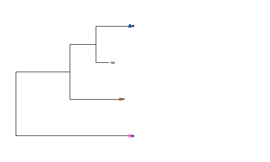

# 3. Palettes and TVD

**In:** the clusters. **Out:** `aggregation/tables/*.ibd_pop.tsv.gz` (one per chromosome), `ibd_pop_tvd.tsv` and plots.

## The palette

Every individual has a **palette**: the total IBD (cM) it shares with each donor population (here, each of the four clusters).
The mixture model reproduces a target's palette as a weighted sum of source palettes. Palettes of one individual from each
population, summed over chromosomes (`example/results/palettes/palettes_cM.tsv`):

| sample_id | population | C0 | C4 | C6 | C7 |
|---|---|---|---|---|---|
| O_001 | O | 2002 | 52 | 49 | 44 |
| S1_001 | S1 | 38 | 294 | 1630 | 1031 |
| S2_001 | S2 | 58 | 1618 | 340 | 817 |
| X_001 | X | 48 | 721 | 912 | 1154 |

As a share of the individual's total:

| sample_id | population | C0 | C4 | C6 | C7 |
|---|---|---|---|---|---|
| O_001 | O | 0.932 | 0.024 | 0.023 | 0.021 |
| S1_001 | S1 | 0.013 | 0.098 | 0.544 | 0.344 |
| S2_001 | S2 | 0.021 | 0.571 | 0.120 | 0.288 |
| X_001 | X | 0.017 | 0.254 | 0.322 | 0.407 |

Individuals share most IBD with their own cluster. X_001 has 0.32 of its palette with S1 (C6), 0.25 with S2
(C4) and 0.41 with other X individuals (C7). Its S1:S2 ratio is the signal the mixture model uses; the X-to-X sharing is
the part no source can explain (`self_share`, page 5).

To keep the sums over the same number of donors, `aggregate_ibd` sums each individual's within-cluster entry over the n-1 other
members and its between-cluster entries over a random n-1 of the n donors. `aggregation.seed` fixes that draw.

## TVD

The total variation distance between the palettes of the populations (`example/results/palettes/tvd.tsv`) is the distance
used for the population tree and for choosing sources automatically:

| cluster | C0 | C4 | C6 | C7 |
|---|---|---|---|---|
| C0 | 0.0 | 0.916 | 0.917 | 0.916 |
| C4 | 0.916 | 0.0 | 0.501 | 0.342 |
| C6 | 0.917 | 0.501 | 0.0 | 0.204 |
| C7 | 0.916 | 0.342 | 0.204 | 0.0 |

The outgroup (C0) is far from everything (0.92 or more). Among the others, X (C7) is closest to S1 (C6, 0.20), then to S2 (C4, 0.34), and S1 and S2 are 0.50 apart: X lies between its two sources, nearer the one it takes more ancestry from.

## Knobs

`aggregation.ibd_params` (segment length and LOD filters for the palette), `aggregation.seed`, the colour-map keys
(`aggregation.color_*`; this example uses `color_map_embedding: mds3` because `tsne3` needs more clusters). See
[`docs/CONFIGURATION.md`](../CONFIGURATION.md#aggregation).

---
[Walkthrough home](README.md) · generated by `example/make_walkthrough.py` from `example/results/`
