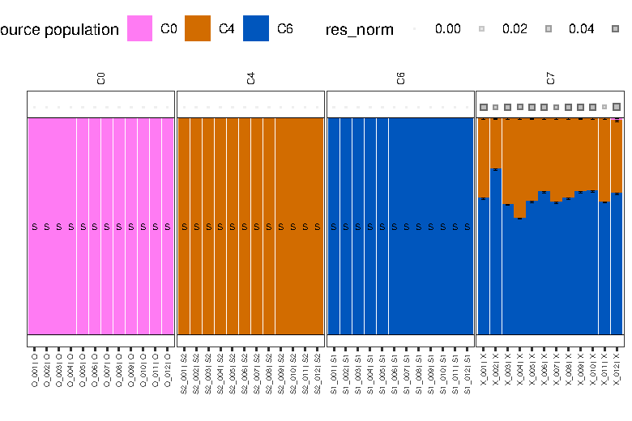

# 4. Mixture modelling

**In:** the palettes and a mixture file, `config/panels/default/mixture_four_pop.tsv`, which says which individuals are sources and
which are targets:

```
sample_id  group
O_001      source
O_002      source
...
```

O, S1 and S2 individuals are the sources (individuals of one cluster are pooled into one source) and the 12 X individuals are the
targets. **Out:** `mixmodel/four_pop/tables/example_dataset.mixmodel_{nnls,bayesian}.tsv`, one row per target and source, and plots.

Two estimators run on the same palettes:
- `nnls`: sum-to-one non-negative least squares, with a jackknife standard error over chromosomes;
- `bayesian`: a MCMC with a Dirichlet prior and a search over which sources are active.

## Result

Mean estimated ancestry of the 12 X individuals (C6 = S1, C4 = S2, C0 = O), against the truth from the simulation:

| X individuals, mean | S1 | S2 | O |
|---|---|---|---|
| realized | 0.600 | 0.400 | 0.000 |
| Bayesian | 0.638 | 0.360 | 0.002 |
| NNLS | 0.626 | 0.371 | 0.003 |

Individual estimates vary by about 0.053 around the Bayesian mean.



The panels are the O, S1, S2 and X individuals and each bar is one individual, coloured by the sources it is assigned to. The O, S1
and S2 individuals are the sources, so each is shown as its own source; the X individuals are the targets and show the mixture.

## One individual

The rows of X_001 in the two tables (`mixmodel_bayesian.tsv`, `mixmodel_nnls.tsv`):

| source_pop | Bayesian p | Bayesian se | NNLS p | NNLS se |
|---|---|---|---|---|
| C0 | 0.001 | 0.001 | 0.004 | 0.004 |
| C4 | 0.367 | 0.006 | 0.381 | 0.036 |
| C6 | 0.632 | 0.006 | 0.615 | 0.035 |

`p` is the weight of the source and `se` its standard error (NNLS: jackknife over chromosomes; Bayesian: posterior). Weights sum
to 1 for a target. The same rows carry the residual of the fit (0.060 on the RMSE scale for both estimators) and
`self_share` (0.41); they are explained on [page 5](5-diagnostics.md).

## Why the estimates are above the truth

Both estimators give S1 more than 0.600. The main reason is that 38% of an X individual's palette is sharing with
other X individuals, which no source explains; the fit spreads it over S1 and S2. A smaller reason is the palette scale: with the
default `palette_scale: normalized` a source is weighted by its ancestry share times its total IBD per individual, so a source
with more IBD per individual (S1 here, 6% more than S2) is slightly over-credited. [Page 7](7-variants.md) refits with raw palettes.

The own-cluster effect is exaggerated in this example: X is a small, recently founded and strongly drifted population, and the panel has only four populations, so a large share of its sharing is within X. In larger datasets with many populations most targets share a much smaller part of their IBD with their own cluster, and the bias from this is usually small. Strongly endogamous cohorts are the exception and can still have a large `self_share`.

## Knobs

`mixture.method` (`nnls`, `bayesian`, `both`), `mixture.seed`, `mixture.palette_scale`, `mixture.mean_active_sources`,
`mixture.mcmc_iter` and the other MCMC keys, `mixture.two_stage_se`. See [`docs/CONFIGURATION.md`](../CONFIGURATION.md#mixture).

---
[Walkthrough home](README.md) · generated by `example/make_walkthrough.py` from `example/results/`
